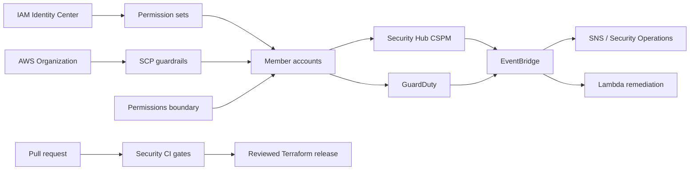

# AWS Cloud Security Governance Platform

A portfolio-grade reference implementation for governing a multi-account AWS environment through
preventive guardrails, federated least privilege, shift-left security, centralized threat detection,
and bounded event-driven remediation.

> **Safe by default:** organization policy attachments are disabled and Lambda remediation runs in
> dry-run mode until explicit variables are changed. Deploy first to a sandbox organization and
> review every policy for your account structure.

## Business problem

Cloud security teams must translate architectural standards into controls that developers can use,
auditors can verify, and incident responders can operate. This project models that operating system:

- **Architecture alignment:** control objectives map to the AWS Well-Architected Security Pillar.
- **Identity governance:** SCPs, a permissions boundary, and IAM Identity Center permission sets
  combine to constrain effective permissions.
- **DevSecOps:** pull requests run Terraform validation, policy scanning, secret scanning, dependency
  auditing, static analysis, and Lambda unit tests.
- **Threat detection:** Security Hub CSPM and GuardDuty findings flow through EventBridge to
  notification and remediation paths.
- **Incident response:** Tier 3 runbooks define triage, containment, evidence preservation,
  escalation, recovery, and post-incident improvement.

## Architecture



See [Architecture and trust boundaries](docs/architecture.md) for the detailed design.

## Repository map

```text
terraform/   deployable AWS controls grouped into focused modules
lambda/      bounded S3 public-access remediation
tests/       unit tests and representative Security Hub event fixtures
scripts/     repeatable local validation and evidence collection
docs/        control mapping, operations, incident response, and troubleshooting
.github/     shift-left security workflow
```

## Status

The project is being built in auditable milestones. Each commit represents a meaningful architecture,
implementation, validation, or remediation step.

## Safety and cost

This project can create billable AWS resources. It does not deploy automatically from CI and does not
require repository secrets for validation. Review `terraform plan`, use a dedicated security sandbox,
and destroy test resources when finished.

## License

MIT

