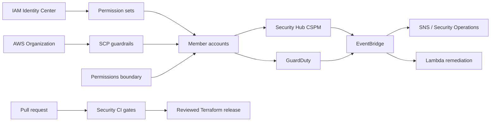

# AWS Cloud Security Governance Platform

[](https://github.com/JoelMAnglin/aws-cloud-security-governance-platform/actions/workflows/security-ci.yml)

A portfolio-grade reference implementation for governing a multi-account AWS environment through
preventive guardrails, federated least privilege, shift-left security, centralized threat detection,
and bounded event-driven remediation.

> **Safe by default:** organization policy attachments are disabled and Lambda remediation runs in
> dry-run mode until explicit variables are changed. Deploy first to a sandbox organization and
> review every policy for your account structure.

## Business problem

Cloud security teams must translate architectural standards into controls that developers can use,
auditors can verify, and incident responders can operate. This project models that operating system:

- **Architecture alignment:** control objectives map to the AWS Well-Architected Security Pillar.
- **Identity governance:** SCPs, a permissions boundary, and IAM Identity Center permission sets
  combine to constrain effective permissions.
- **DevSecOps:** pull requests run Terraform validation, policy scanning, secret scanning, dependency
  auditing, static analysis, and Lambda unit tests.
- **Threat detection:** Security Hub CSPM and GuardDuty findings flow through EventBridge to
  notification and remediation paths.
- **Incident response:** Tier 3 runbooks define triage, containment, evidence preservation,
  escalation, recovery, and post-incident improvement.

## Architecture



See [Architecture and trust boundaries](docs/architecture.md) for the detailed design.

## Repository map

```text
terraform/   deployable AWS controls grouped into focused modules
lambda/      bounded S3 public-access remediation
tests/       unit tests and representative Security Hub event fixtures
scripts/     repeatable local validation and evidence collection
docs/        control mapping, operations, incident response, and troubleshooting
.github/     shift-left security workflow
```

## Implemented controls

- Three SCPs: protect security services, restrict regions, and establish a data perimeter
- Workload-developer permissions boundary that blocks common privilege-escalation paths
- IAM Identity Center SecurityAdmin permission set with a two-hour session and group assignments
- Security Hub CSPM and GuardDuty with S3, EKS audit-log, and EBS malware-protection features
- EventBridge routing to encrypted SNS notifications and a bounded Lambda remediation path
- Customer-managed KMS keys with rotation for notification and remediation logs
- Dry-run-first public S3 remediation with four unit tests and 93% statement coverage
- High/critical IaC, secret, dependency, and static-analysis gates in GitHub Actions

## Repeatable local validation

Requirements: Git, Python 3.12+, Docker Desktop, and PowerShell. Terraform runs in a pinned container,
so a global Terraform installation is optional.

```powershell
git clone https://github.com/JoelMAnglin/aws-cloud-security-governance-platform.git
Set-Location .\aws-cloud-security-governance-platform
powershell.exe -NoProfile -ExecutionPolicy Bypass -File .\scripts\validate.ps1
```

The script installs development tools, runs lint/format checks, executes tests with a 90% coverage
gate, runs Bandit and pip-audit, validates Terraform, and scans the filesystem with Trivy.

## Safe deployment walkthrough

1. Use a dedicated AWS security sandbox and authenticated CLI profile.
2. Copy `terraform/terraform.tfvars.example` to an ignored `terraform/terraform.tfvars`.
3. Replace organization, OU, Identity Center, group, account, and email placeholders.
4. Keep both enforcement switches false for the first plan.

```powershell
docker run --rm -v "${PWD}:/workspace" -w /workspace/terraform hashicorp/terraform:1.10.5 init
docker run --rm -v "${PWD}:/workspace" -w /workspace/terraform hashicorp/terraform:1.10.5 plan -out=security.tfplan
```

Review the plan with a second engineer. After policy simulation and sandbox tests, attach SCPs to one
sandbox OU. Enable automated remediation only after the dry-run logs, ownership process, exception
path, and rollback have been validated.

## Demonstrate the Lambda safely

The fixture mirrors the Security Hub ASFF envelope. Unit tests prove dry-run, live-client calls,
resource filtering, and malformed-event handling without AWS credentials.

```powershell
python -m pytest -v
```

After a sandbox deployment, invoke the dry-run function with `scripts/test-event.ps1`.

## Leadership and operations artifacts

- [AWS Security Pillar control mapping](docs/control-mapping.md)
- [Security engineering leadership operating model](docs/leadership-operating-model.md)
- [Tier 3 public S3 exposure runbook](docs/incident-response.md)
- [Troubleshooting runbook](docs/troubleshooting.md)
- [Actual build troubleshooting journal](docs/troubleshooting-journal.md)
- [Architecture decision log](docs/decision-log.md)

## Interview talking points

- SCPs and permissions boundaries constrain maximum permissions; neither grants access.
- Organization-wide controls use progressive rollout because a deny can affect every child account.
- Automated containment begins in dry-run and becomes enforcing only with ownership and rollback.
- CI is credential-free: code validation is separated from privileged deployment approval.
- Real validation findings were preserved as a fix commit and troubleshooting evidence.

## Resume bullet

> Built an AWS cloud security governance platform with organization SCPs, IAM Identity Center,
> permissions boundaries, Security Hub, GuardDuty, EventBridge/Lambda remediation, encrypted alerting,
> 93%-covered tests, security CI gates, and Tier 3 incident-response runbooks aligned to the AWS
> Well-Architected Security Pillar.

## Safety and cost

This project can create billable AWS resources. It does not deploy automatically from CI and does not
require repository secrets for validation. Review `terraform plan`, use a dedicated security sandbox,
and destroy test resources when finished.

## Authoritative references

- [AWS Well-Architected Security Pillar](https://docs.aws.amazon.com/wellarchitected/latest/security-pillar/welcome.html)
- [AWS Organizations service control policies](https://docs.aws.amazon.com/organizations/latest/userguide/orgs_manage_policies_scps.html)
- [IAM policies and permissions](https://docs.aws.amazon.com/IAM/latest/UserGuide/access_policies.html)
- [IAM Identity Center delegated administration](https://docs.aws.amazon.com/singlesignon/latest/userguide/delegated-admin.html)
- [Security Hub automated response with EventBridge](https://docs.aws.amazon.com/securityhub/latest/userguide/securityhub-cloudwatch-events.html)
- [GuardDuty findings with EventBridge](https://docs.aws.amazon.com/guardduty/latest/ug/guardduty_findings_eventbridge.html)

## License

MIT
